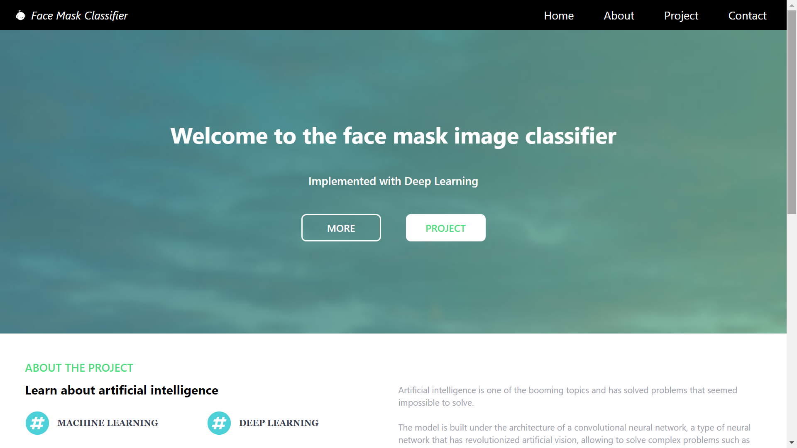
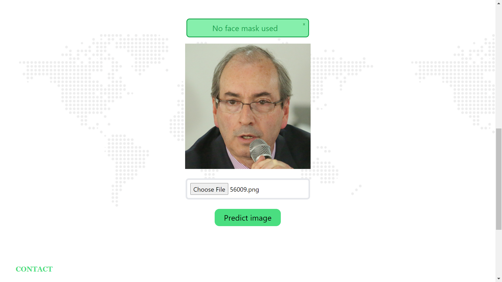

# Face mask image classifier

Web application to make an image classification to a convolutional neural network (CNN). It predicts 3 possible scenarios:  
    &nbsp;&nbsp; - Person with no face mask  
    &nbsp;&nbsp; - Person with a face mask used correctly  
    &nbsp;&nbsp; - Person with a face mask used incorrectly  
 

# Toolset

## Python
    - Jupyter Notebook
    - Flask
    - Important modules: numpy, matplotlib, tensorflow, sk_learn, cv2
## React
    - ReactJS
    - React Hooks
    - Important modules: react-scroll
## Tailwind CSS
    - CSS framework
 

# Website

## Home page

 

  

## Project page

 

  

# Improvements

In the future, some new features could be added such as object detection or image segmentation.